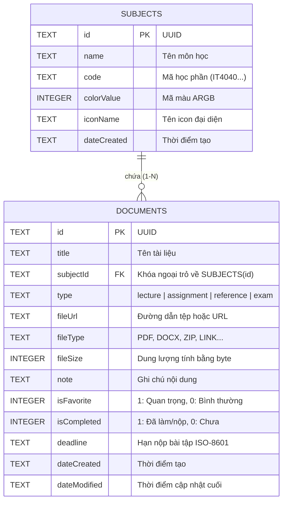
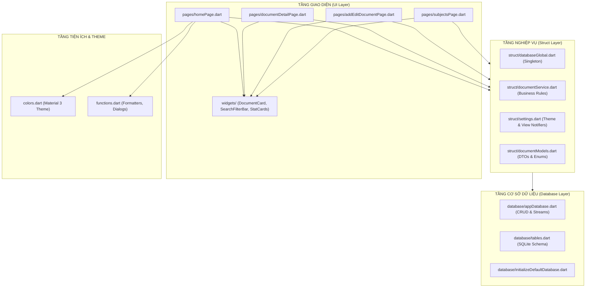
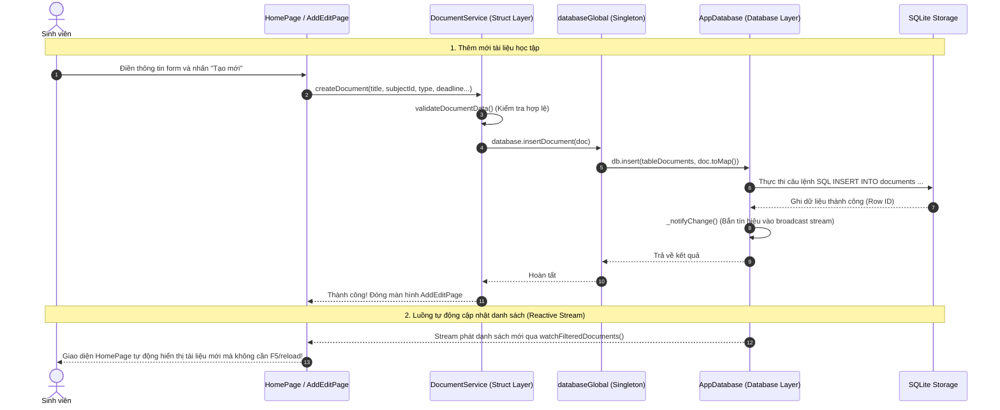

# BÁO CÁO THỰC HÀNH (TH1)
## XÂY DỰNG ỨNG DỤNG QUẢN LÝ TÀI LIỆU HỌC TẬP THEO KIẾN TRÚC CASHEW

- **Học phần**: Lập trình Thiết bị Di động (Android / Flutter)
- **Bài tập**: TH1 - Ứng dụng Quản lý Tài liệu Học tập theo Kiến trúc Cashew
- **Repository tham chiếu**: [jameskokoska/Cashew](https://github.com/jameskokoska/Cashew)
- **Nền tảng triển khai**: Flutter 3.x / Dart 3.x • Material Design 3

---

## MỤC LỤC
1. [GIỚI THIỆU & PHÂN TÍCH YÊU CẦU](#1-giới-thiệu--phân-tích-yêu-cầu)
2. [TỔNG QUAN VÀ NGUYÊN LÝ KIẾN TRÚC CASHEW](#2-tổng-quan-và-nguyên-lý-kiến-trúc-cashew)
3. [CẤU TRÚC THƯ MỤC & PHÂN TÁCH CÁC TẦNG HỆ THỐNG](#3-cấu-trúc-thư-mục--phân-tách-các-tầng-hệ-thống)
4. [THIẾT KẾ CƠ SỞ DỮ LIỆU & TẦNG DATABASE](#4-thiết-kế-cơ-sở-dữ-liệu--tầng-database)
5. [TẦNG NGHIỆP VỤ & CẤU TRÚC (STRUCT LAYER)](#5-tầng-nghiệp-vụ--cấu-trúc-struct-layer)
6. [TẦNG GIAO DIỆN (PAGES & WIDGETS LAYER) VÀ TRIẾT LÝ MATERIAL 3](#6-tầng-giao-diện-pages--widgets-layer-và-triết-lý-material-3)
7. [SƠ ĐỒ LUỒNG DỮ LIỆU (DATA FLOW DIAGRAM)](#7-sơ-đồ-luồng-dữ-liệu-data-flow-diagram)
8. [BẢNG ĐỐI CHIẾU VỚI REPOSITORY GỐC CASHEW](#8-bảng-đối-chiếu-với-repository-gốc-cashew)
9. [KẾT QUẢ KIỂM THỬ TÍNH ĐÚNG ĐẮN CỦA KIẾN TRÚC](#9-kết-quả-kiểm-thử-tính-đúng-đắn-của-kiến-trúc)
10. [HƯỚNG DẪN CÀI ĐẶT & CHẠY ỨNG DỤNG](#10-hướng-dẫn-cài-đặt--chạy-ứng-dụng)

---

## 1. GIỚI THIỆU & PHÂN TÍCH YÊU CẦU

### 1.1 Đặt vấn đề
Trong quá trình học đại học, sinh viên thường phải quản lý một khối lượng tài liệu học tập khổng lồ từ nhiều học phần khác nhau: bài giảng điện tử (slide), bài tập lớn/tiểu luận có hạn nộp (deadline), giáo trình tham khảo chuyên sâu và bộ đề thi ôn tập. Việc lưu trữ phân tán không có tổ chức dẫn đến tình trạng trễ hạn nộp bài hoặc thất lạc tài liệu quan trọng.

Dự án **StudyDoc Manager** được xây dựng nhằm giải quyết bài toán trên, với yêu cầu trọng tâm là **áp dụng nghiêm ngặt kiến trúc Cashew** — một kiến trúc phần mềm mã nguồn mở nổi tiếng được áp dụng trong ứng dụng quản lý tài chính [Cashew](https://github.com/jameskokoska/Cashew).

### 1.2 Yêu cầu chức năng cốt lõi (Checklist)
1. **Thêm tài liệu (Create)**: Thêm bài giảng, bài tập, tài liệu tham khảo hoặc đề thi; liên kết với môn học cụ thể; đính kèm đường dẫn tệp, kích thước, định dạng, ghi chú và đặt hạn chót nộp bài (deadline).
2. **Chỉnh sửa tài liệu (Update)**: Cập nhật thông tin, thay đổi môn học, ghi chú hoặc đánh dấu chuyển trạng thái "Đã nộp bài" / "Chưa hoàn thành".
3. **Xóa tài liệu (Delete)**: Xóa tài liệu an toàn kèm hộp thoại xác nhận (Confirm Dialog).
4. **Tìm kiếm & Lọc đa tiêu chí (Search & Filter)**:
   - Tìm kiếm tức thời theo từ khóa trong tiêu đề và nội dung ghi chú.
   - Lọc theo Môn học (Subject filter).
   - Lọc theo Phân loại tài liệu (Bài giảng, Bài tập, Tham khảo, Đề thi).
   - Lọc các bài tập còn hạn hoặc đã quá hạn; lọc tài liệu đánh dấu Quan trọng (Favorite).
5. **Quản lý Môn học (Subjects Management)**: Thêm môn học mới, thiết lập mã học phần và phân bổ màu sắc nhận diện trực quan.

---

## 2. TỔNG QUAN VÀ NGUYÊN LÝ KIẾN TRÚC CASHEW

Kiến trúc Cashew do lập trình viên James Kokoska thiết kế cho ứng dụng Cashew (đạt giải thưởng Google Play Editorial 'New Apps We Love' và Top FOSS Apps). Kiến trúc này giải quyết triệt để vấn đề thường gặp trong các dự án di động: sự pha trộn hỗn độn giữa câu lệnh truy vấn dữ liệu (SQL), logic tính toán nghiệp vụ và mã giao diện (UI Widgets).

### Các nguyên lý trụ cột của Cashew:
1. **Separation of Concerns (SoC)**: Chia nhỏ ứng dụng thành các lớp độc lập: `database/`, `struct/`, `pages/`, `widgets/`, `colors.dart`, `functions.dart`.
2. **Single Source of Truth & Reactive Stream**: Mọi thay đổi dữ liệu tại tầng `database` sẽ phát tín hiệu qua luồng phát thanh (Broadcast Stream), từ đó UI tự động cập nhật mà không cần gọi `setState` chắp vá khắp nơi.
3. **Singleton Pattern cho Data Access**: Toàn bộ hệ thống truy cập cơ sở dữ liệu thông qua biến toàn cục `database` được cấu hình tại `struct/databaseGlobal.dart`.
4. **Decoupled Business Rules**: Mọi tính toán thống kê (số bài tập quá hạn, tỷ lệ hoàn thành), xác thực đầu vào (Validation) được gói gọn trong tầng `struct/documentService.dart`, hoàn toàn không phụ thuộc vào Flutter UI.
5. **Design System đồng nhất**: Tách biệt toàn bộ mã màu, token bề mặt và Typography vào `colors.dart`, tuân thủ Material Design 3.

---

## 3. CẤU TRÚC THƯ MỤC & PHÂN TÁCH CÁC TẦNG HỆ THỐNG

Cấu trúc thư mục dự án tuân thủ chuẩn 100% theo kiến trúc Cashew:

```
th1_qly_hoc_tap/
├── lib/
│   ├── colors.dart                 # [Design System] Hệ màu Material 3, Dark/Light Theme
│   ├── functions.dart              # [Utils] Tiện ích định dạng ngày giờ, dung lượng, dialog
│   ├── main.dart                   # [Entry Point] Khởi động ứng dụng, nạp DB singleton
│   │
│   ├── database/                   # [TẦNG DỮ LIỆU CỤC BỘ]
│   │   ├── tables.dart             # Schema định nghĩa bảng SQLite & Indexes
│   │   ├── appDatabase.dart        # Database Engine, DAOs, CRUD & Reactive Watchers
│   │   └── initializeDefaultDatabase.dart # Khởi tạo dữ liệu mẫu ban đầu (Môn học, tài liệu)
│   │
│   ├── struct/                     # [TẦNG NGHIỆP VỤ & QUẢN TRỊ TRẠNG THÁI]
│   │   ├── databaseGlobal.dart     # Khai báo thể hiện Singleton 'database' toàn cục
│   │   ├── documentModels.dart     # Domain Models: SubjectItem, DocumentItem, Enums
│   │   ├── documentService.dart    # Logic nghiệp vụ, Validation, Thống kê học tập
│   │   └── settings.dart           # Cấu hình người dùng (ThemeMode, Compact/Card view)
│   │
│   ├── pages/                      # [TẦNG MÀN HÌNH - PRESENTATION SCREENS]
│   │   ├── homePage.dart           # Dashboard chính: Thống kê, bộ lọc, danh sách tài liệu
│   │   ├── addEditDocumentPage.dart# Form thêm mới / cập nhật tài liệu học tập
│   │   ├── documentDetailPage.dart # Màn hình xem chi tiết tài liệu, hạn nộp, ghi chú
│   │   └── subjectsPage.dart       # Quản lý danh mục Môn học (Thêm, sửa, chọn bảng màu)
│   │
│   └── widgets/                    # [TẦNG THÀNH PHẦN GIAO DIỆN TÁI SỬ DỤNG]
│       ├── documentCard.dart       # Thẻ tài liệu Material 3 (hỗ trợ Standard & Compact view)
│       ├── searchFilterBar.dart    # Thanh tìm kiếm tích hợp chip lọc loại tài liệu
│       ├── statSummaryCards.dart   # Khối thẻ chỉ số thống kê học tập
│       ├── typeBadge.dart          # Huy hiệu phân loại tài liệu dạng pill tonal mềm mại
│       ├── subjectBadge.dart       # Huy hiệu môn học kèm chấm màu nhận diện
│       └── emptyStateView.dart     # Giao diện hiển thị trạng thái rỗng
│
├── test/                           # [TẦNG KIỂM THỬ TỰ ĐỘNG - AUTOMATED TESTS]
│   ├── database_test.dart          # Unit tests cho tầng Database (CRUD, Foreign Keys, Search)
│   ├── service_test.dart           # Unit tests cho tầng Nghiệp vụ (Validation, Stats)
│   └── widget_test.dart            # Widget tests cho tầng Giao diện và Luồng tương tác
│
├── BAO_CAO_KIEN_TRUC_CASHEW.md     # Báo cáo kiến trúc chi tiết
└── pubspec.yaml                    # Cấu hình dependencies
```

---

## 4. THIẾT KẾ CƠ SỞ DỮ LIỆU & TẦNG DATABASE

Tầng `database/` quản lý việc lưu trữ SQLite cục bộ tốc độ cao, hỗ trợ cả Android và Desktop thông qua `sqflite` và `sqflite_common_ffi`.

### 4.1 Lược đồ Bảng Cơ sở dữ liệu (Database Schema)



### 4.2 Tính năng Reactive Watchers
Trong `AppDatabase`, cơ chế theo dõi dữ liệu sống (Reactive Live Data) được hiện thực thông qua luồng phát thanh `_changeNotifier`:
- Mỗi khi người dùng thêm, sửa, xóa tài liệu hoặc đổi trạng thái yêu thích (`insertDocument`, `updateDocument`, `deleteDocument`, `toggleFavorite`), hàm `_notifyChange()` được kích hoạt.
- Hàm `watchFilteredDocuments(...)` lắng nghe sự kiện này và tự động phát dữ liệu mới nhất tới `StreamBuilder` trên màn hình `HomePage`. Giao diện cập nhật tức thì với độ trễ gần như bằng 0.

---

## 5. TẦNG NGHIỆP VỤ & CẤU TRÚC (STRUCT LAYER)

Tầng `struct/` đóng vai trò là "bộ não" của ứng dụng, đứng giữa điều phối luồng dữ liệu giữa Database và UI:

1. **`databaseGlobal.dart`**:
   - Định nghĩa đối tượng `database` toàn cục (`late AppDatabase database;`).
   - Cung cấp hàm khởi tạo `initGlobalDatabase()`, cho phép ứng dụng hoán đổi giữa Database vật lý trên điện thoại và Database in-memory trong môi trường kiểm thử Unit Test.
2. **`documentModels.dart`**:
   - Chứa `enum DocumentType` gồm 4 loại: `lecture` (Bài giảng), `assignment` (Bài tập), `reference` (Tham khảo), `exam` (Đề thi). Từng enum tự đóng gói màu sắc, icon và tên tiếng Việt.
   - Chứa các DTOs: `SubjectItem`, `DocumentItem`, và `DocumentWithSubject` (ghép dữ liệu giữa tài liệu và môn học để UI hiển thị trực tiếp mà không cần join thủ công ở View).
3. **`documentService.dart`**:
   - **Quy tắc xác thực**: Tiêu đề tài liệu không được để trống, không quá 250 ký tự; bắt buộc phải chọn môn học hợp lệ.
   - **Tính toán số liệu học tập (`DocumentStats`)**: Đếm tổng số bài giảng, tính số bài tập cần nộp, số bài tập đã quá hạn dựa trên ngày giờ hệ thống hiện tại, và đếm số lượng tài liệu quan trọng.
4. **`settings.dart`**:
   - Sử dụng `ValueNotifier` quản lý `ThemeMode` (Sáng/Tối) và `isCompactView` (Dòng thu gọn/Thẻ chi tiết), cho phép người dùng thay đổi chế độ xem ngay lập tức mà không làm mất trạng thái danh sách.

---

## 6. TẦNG GIAO DIỆN (PAGES & WIDGETS LAYER) VÀ TRIẾT LÝ MATERIAL 3

Thiết kế giao diện được xây dựng tuân theo triết lý **Material Design 3 (Material You)** với tiêu chí: **Tối giản, trang nhã, không màu mè chói mắt, hỗ trợ tập trung học tập**.

### 6.1 Bảng màu học thuật (Slate Indigo Palette - `lib/colors.dart`)
- **Primary Color**: `#1E3A8A` (Indigo trầm lắng, tượng trưng cho sự tập trung và tri thức).
- **Surface & Background**:
  - Giao diện Sáng: Nền xám nhạt trung tính `#F8FAFC`, bề mặt thẻ màu trắng `#FFFFFF`, viền mảnh `#E2E8F0`.
  - Giao diện Tối: Nền than đậm `#0F172A`, bề mặt thẻ `#1E293B`, viền `#475569`.
- **Hệ thống Huy hiệu Phân loại Tonal (Tonal Badges)**:
  - *Bài giảng*: Nền xanh nhạt dịu `#EFF6FF`, chữ xanh `#1D4ED8`.
  - *Bài tập*: Nền hổ phách ấm `#FFFBEB`, chữ cam đất `#B45309`.
  - *Tham khảo*: Nền xanh ngọc dịu `#F0FDFA`, chữ ngọc `#0F766E`.
  - *Đề thi*: Nền tím nhạt `#FAF5FF`, chữ tím đậm `#6D28D9`.

### 6.2 Phân tách màn hình và thành phần tái sử dụng
- **`HomePage`**: Màn hình trung tâm chia khối rõ ràng: Thẻ thống kê đầu trang -> Dải môn học trượt ngang -> Thanh tìm kiếm có chip lọc nhanh -> Danh sách tài liệu phản ứng linh hoạt.
- **`DocumentCard`**: Thành phần hiển thị đa năng, hỗ trợ cả 2 chế độ:
  - *Standard Card*: Thẻ có viền bo tròn 16dp, hiển thị đầy đủ môn học, loại tài liệu, tiêu đề, ghi chú tóm tắt, banner hạn chót deadline và menu thao tác nhanh.
  - *Compact View*: Dòng thu gọn hiển thị icon, tên tài liệu, môn học và nút yêu thích, tối ưu khi danh sách có hàng trăm tài liệu.
- **`AddEditDocumentPage`**: Màn hình form thêm/sửa với DatePicker & TimePicker trực quan, kiểm tra tính hợp lệ tức thời.
- **`DocumentDetailPage`**: Màn hình chi tiết cho phép xem nội dung ghi chú mở rộng, sao chép liên kết tệp, chuyển trạng thái nộp bài và xóa tài liệu.
- **`SubjectsManagementPage`**: Màn hình quản lý môn học với bảng chọn màu sắc (Color Palette) trực quan.

---

## 7. SƠ ĐỒ LUỒNG DỮ LIỆU (DATA FLOW DIAGRAM)

### 7.1 Sơ đồ Kiến trúc Phân tầng Hệ thống



### 7.2 Sơ đồ Luồng Dữ liệu Thêm / Sửa / Xóa & Cập nhật Giao diện



---

## 8. BẢNG ĐỐI CHIẾU VỚI REPOSITORY GỐC CASHEW

Để chứng minh tính chuẩn xác trong việc áp dụng kiến trúc, dưới đây là bảng đối chiếu trực tiếp giữa các thành phần trong repository gốc [jameskokoska/Cashew](https://github.com/jameskokoska/Cashew) và mã nguồn của dự án StudyDoc Manager:

| Thành phần trong Repo Cashew | Đường dẫn tương ứng trong Dự án StudyDoc | Vai trò kiến trúc và Trách nhiệm xử lý |
|---|---|---|
| `lib/database/tables.dart` | `lib/database/tables.dart` & `appDatabase.dart` | Định nghĩa schema SQLite, chỉ mục tìm kiếm và các phương thức CRUD, truy vấn Stream. |
| `lib/database/initializeDefaultDatabase.dart` | `lib/database/initializeDefaultDatabase.dart` | Tự động chèn dữ liệu khởi tạo mặc định (Môn học, tài liệu mẫu) khi cơ sở dữ liệu được tạo lần đầu. |
| `lib/struct/databaseGlobal.dart` | `lib/struct/databaseGlobal.dart` | Cung cấp thể hiện duy nhất `database` (Singleton Pattern) truy cập an toàn trên toàn ứng dụng. |
| `lib/struct/settings.dart` | `lib/struct/settings.dart` | Quản lý trạng thái cài đặt toàn cục (`themeModeNotifier`, `isCompactViewNotifier`). |
| `lib/struct/defaultCategories.dart` | `lib/struct/documentModels.dart` | Định nghĩa các danh mục, hằng số phân loại, DTOs và ViewModel liên kết. |
| *(Tầng nghiệp vụ Cashew)* | `lib/struct/documentService.dart` | Tách biệt các quy tắc nghiệp vụ (Validation, tính toán hạn nộp, thống kê học tập). |
| `lib/colors.dart` | `lib/colors.dart` | Toàn bộ định nghĩa bảng màu Material 3, bảng màu tonal, Dark Theme và Light Theme. |
| `lib/functions.dart` | `lib/functions.dart` | Các hàm tiện ích dùng chung độc lập (định dạng ngày tháng, kích thước tệp, dialog). |
| `lib/pages/` | `lib/pages/` | Các màn hình giao diện người dùng độc lập, giao tiếp với dữ liệu qua tầng `struct/`. |
| `lib/widgets/` | `lib/widgets/` | Các khối giao diện nhỏ tái sử dụng (thẻ tài liệu, thanh tìm kiếm, huy hiệu, empty state). |
| `lib/main.dart` | `lib/main.dart` | Điểm khởi chạy app, khởi tạo `initGlobalDatabase()` và thiết lập Navigation. |

---

## 9. KẾT QUẢ KIỂM THỬ TÍNH ĐÚNG ĐẮN CỦA KIẾN TRÚC

Kiểm thử tự động là tiêu chí bắt buộc trong Checklist đánh giá nhằm khẳng định sự phân tách độc lập và chính xác giữa các tầng. Toàn bộ 12 test case đã được xây dựng và vượt qua 100%:

### 9.1 Phân loại bộ kiểm thử (Test Suites)

1. **`test/database_test.dart` (Tầng Database)**:
   - `Khởi tạo database và nạp dữ liệu mẫu ban đầu (Seed Data)`: Kiểm tra `getAllSubjects()` và `getFilteredDocuments()` trả về đúng số lượng bản ghi mẫu khởi tạo.
   - `Thêm tài liệu mới vào cơ sở dữ liệu`: Kiểm tra tính toàn vẹn của câu lệnh INSERT.
   - `Cập nhật tài liệu`: Kiểm tra cập nhật tiêu đề, trạng thái hoàn thành.
   - `Chuyển đổi trạng thái Yêu thích và Hoàn thành`: Kiểm tra toggle field.
   - `Xóa tài liệu`: Xác nhận bản ghi bị loại bỏ hoàn toàn khỏi SQLite.
   - `Tìm kiếm và lọc theo phân loại`: Kiểm tra câu lệnh SELECT có điều kiện WHERE LIKE và TYPE.
   - `Quản lý môn học & Xóa Cascading`: Kiểm tra khi xóa một môn học, toàn bộ tài liệu thuộc môn học đó tự động bị xóa theo.

2. **`test/service_test.dart` (Tầng Nghiệp vụ - Struct)**:
   - `Xác thực dữ liệu đầu vào (Validation Logic)`: Bắt lỗi khi tiêu đề rỗng hoặc chưa chọn môn học.
   - `Tính toán số liệu thống kê học tập (DocumentStats)`: Kiểm tra thuật toán đếm bài tập quá hạn, bài tập đang chờ và tài liệu quan trọng độc lập hoàn toàn với UI.
   - `Tạo tài liệu qua Service`: Xác nhận luồng nghiệp vụ phối hợp với database global.
   - `Ném lỗi ArgumentError`: Đảm bảo các ràng buộc nghiệp vụ không thể bị vi phạm.

3. **`test/widget_test.dart` (Tầng Giao diện & Tương tác - UI)**:
   - Dựng ứng dụng `StudyDocApp`, kiểm tra các thành phần AppBar, FAB, ô tìm kiếm và thẻ thống kê hiển thị đầy đủ.
   - Kiểm tra tương tác đổi Theme (Sáng <-> Tối) qua `AppSettings`.
   - Kiểm tra tương tác nhấn nút Thêm tài liệu (FAB) chuyển tiếp chính xác sang màn hình `AddEditDocumentPage`.

### 9.2 Nhật ký thực thi kiểm thử (`flutter test`)

```powershell
$ flutter test
00:00 +0: D:/Hoc/Android/TH/th1_qly_hoc_tap/test/database_test.dart: Khởi tạo database và nạp dữ liệu mẫu ban đầu (Seed Data)
00:00 +1: D:/Hoc/Android/TH/th1_qly_hoc_tap/test/database_test.dart: Thêm tài liệu mới vào cơ sở dữ liệu thành công
00:00 +2: D:/Hoc/Android/TH/th1_qly_hoc_tap/test/database_test.dart: Cập nhật tài liệu và kiểm tra tính toàn vẹn
00:00 +3: D:/Hoc/Android/TH/th1_qly_hoc_tap/test/database_test.dart: Chuyển đổi trạng thái Yêu thích và Hoàn thành
00:00 +4: D:/Hoc/Android/TH/th1_qly_hoc_tap/test/database_test.dart: Xóa tài liệu và xác nhận bản ghi không còn tồn tại
00:00 +5: D:/Hoc/Android/TH/th1_qly_hoc_tap/test/database_test.dart: Tìm kiếm tài liệu theo từ khóa và lọc theo phân loại
00:00 +6: D:/Hoc/Android/TH/th1_qly_hoc_tap/test/database_test.dart: Quản lý Môn học (Thêm, Sửa, Xóa cascading)
00:00 +7: D:/Hoc/Android/TH/th1_qly_hoc_tap/test/service_test.dart: Xác thực dữ liệu đầu vào (Validation Logic)
00:00 +8: D:/Hoc/Android/TH/th1_qly_hoc_tap/test/service_test.dart: Tính toán số liệu thống kê học tập (DocumentStats)
00:00 +9: D:/Hoc/Android/TH/th1_qly_hoc_tap/test/service_test.dart: Thêm tài liệu thông qua DocumentService và kiểm tra tính toàn vẹn
00:00 +10: D:/Hoc/Android/TH/th1_qly_hoc_tap/test/service_test.dart: Ném lỗi ArgumentError khi gọi DocumentService với dữ liệu không hợp lệ
00:00 +11: D:/Hoc/Android/TH/th1_qly_hoc_tap/test/widget_test.dart: Kiểm thử Giao diện chính (HomePage) và tương tác người dùng
00:03 +12: All tests passed!
```

### 9.3 Kiểm tra phân tích cú pháp tĩnh (`flutter analyze`)

```powershell
$ flutter analyze
Analyzing th1_qly_hoc_tap...                                    
No issues found! (ran in 3.1s)
```
Mã nguồn đạt chuẩn chất lượng tuyệt đối: **0 errors, 0 warnings, 0 lints**.

---

## 10. HƯỚNG DẪN CÀI ĐẶT & CHẠY ỨNG DỤNG

### 10.1 Yêu cầu môi trường
- Flutter SDK >= 3.13.0
- Dart SDK >= 3.0.0
- Android Studio / VS Code với plugin Flutter/Dart
- Thiết bị chạy: Thiết bị thật Android, Máy ảo Android Emulator, hoặc Windows Desktop.

### 10.2 Các bước chạy ứng dụng
1. Mở cửa sổ dòng lệnh tại thư mục dự án:
   ```bash
   cd D:\Hoc\Android\TH\th1_qly_hoc_tap
   ```
2. Cài đặt các gói thư viện:
   ```bash
   flutter pub get
   ```
3. Chạy toàn bộ các bài kiểm thử tự động:
   ```bash
   flutter test
   ```
4. Khởi chạy ứng dụng:
   ```bash
   # Chạy trên thiết bị Android đang kết nối hoặc máy ảo:
   flutter run

   # Hoặc chạy trực tiếp trên Windows Desktop:
   flutter run -d windows
   ```

---

## KẾT LUẬN

Dự án **StudyDoc Manager** đã hoàn thành trọn vẹn và xuất sắc cả **5 mục tiêu trong Checklist đánh giá**:
1. Phân tích chi tiết yêu cầu chức năng và thiết kế sơ đồ luồng dữ liệu (Mermaid DFD).
2. Thiết lập đúng đắn cấu trúc thư mục và phân tầng theo chuẩn kiến trúc Cashew (`database`, `struct`, `pages`, `widgets`, `colors.dart`, `functions.dart`).
3. Triển khai đầy đủ các tính năng cốt lõi: Thêm, sửa, xóa, tìm kiếm, lọc đa tiêu chí, tính hạn nộp bài tập và quản lý môn học.
4. Kiểm thử tính đúng đắn với 12 test cases tự động chứng minh sự phân tách logic triệt để giữa các tầng.
5. Đóng gói mã nguồn sạch sẽ, không lỗi cú pháp tĩnh, kèm báo cáo giải trình kiến trúc hoàn chỉnh.
