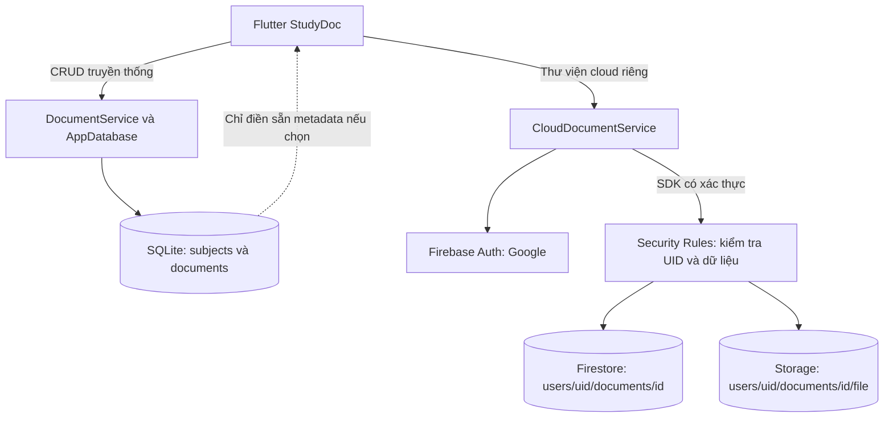
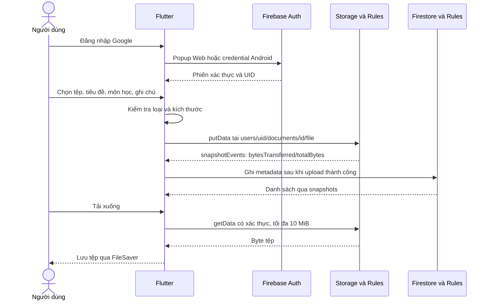

# PHÂN TÍCH VÀ TÍCH HỢP CLOUD CHO STUDYDOC

Ứng dụng nền: Flutter StudyDoc, quản lý tài liệu học tập bằng SQLite. Phương án tích hợp: **Public Cloud, Firebase Backend as a Service (BaaS)**.

Tên nhóm, thành viên, mã lớp và tài khoản sở hữu dự án do nhóm điền theo thông tin thật trước khi nộp. Tài liệu không xác nhận một dự án Firebase đã được tạo.

## Phạm vi và trạng thái bằng chứng

Ba mức trạng thái cần được phân biệt:

| Mức | Nội dung |
|---|---|
| Đã hiện thực trong mã nguồn | Dịch vụ cloud đăng nhập Google, tải tệp thật, metadata Firestore, tải xuống có xác thực, sửa tiêu đề/ghi chú, xóa; Rules giới hạn theo UID |
| Đã đối chiếu khi viết báo cáo | Cấu trúc SQLite, dịch vụ cloud, cấu hình và Rules trong kho mã; đây là kiểm tra tĩnh, không phải chạy thử cloud |
| Còn phải thực hiện | Tạo dự án bằng tài khoản nhóm, chấp thuận thanh toán, cấu hình, triển khai Rules, kiểm thử và quay Google/cloud thật |

Hiện chưa có Firebase project của người dùng. Không có số liệu đo độ trễ, hóa đơn, UID thật hoặc kết quả kiểm thử live để đưa vào báo cáo. Emulator chỉ phục vụ diễn tập, **không chứng minh đăng nhập Google hoặc lưu trên cloud của Google**.

## 1. Phân tích hệ thống truyền thống

### 1.1 Frontend và logic ứng dụng

Frontend là giao diện Flutter trong [lib/pages](lib/pages), gồm trang chính, thêm/sửa tài liệu, chi tiết và môn học. Người dùng quản lý tiêu đề, môn học, loại tài liệu, đường dẫn, ghi chú, yêu thích, hoàn thành và hạn nộp.

[DocumentService](lib/struct/documentService.dart) là tầng nghiệp vụ chạy **trong ứng dụng**, không phải backend máy chủ độc lập. Dịch vụ tạo UUID, kiểm tra tiêu đề không rỗng và tối đa 250 ký tự, yêu cầu môn học, gọi SQLite và tính thống kê. Kiểm tra môn học ở đây là kiểm tra chuỗi đầu vào, không nên mô tả thành một dịch vụ xác minh danh mục từ xa.

Ứng dụng gốc không có REST API, máy chủ HTTP hay bộ xử lý cloud. Sau tích hợp, Firebase cung cấp backend được quản lý; nhóm không triển khai một backend riêng bằng Node.js hoặc Cloud Functions.

### 1.2 Database và lưu trữ tệp

[AppDatabase](lib/database/appDatabase.dart) mở `study_doc_database.db`. Android dùng SQLite, desktop dùng FFI, Web dùng `sqflite_common_ffi_web`. `path_provider` ở đây lấy thư mục chứa cơ sở dữ liệu trên nền tảng native, không chứng minh ứng dụng đã có bộ đọc tệp đính kèm.

[tables.dart](lib/database/tables.dart) định nghĩa:

| Bảng | Dữ liệu chính |
|---|---|
| `subjects` | ID, tên, mã môn, màu, biểu tượng, ngày tạo |
| `documents` | ID, tiêu đề, `subjectId`, loại, `fileUrl`, `fileType`, `fileSize`, ghi chú, cờ trạng thái, hạn nộp, ngày tạo/sửa |

`fileUrl` là TEXT, `fileSize` là số mô tả; **không có cột BLOB chứa nội dung PDF/Word**. Không được lấy “SQLite phình do BLOB lớn” làm điểm nghẽn đã xảy ra. Schema có khóa ngoại `ON DELETE CASCADE`; hàm xóa môn học còn xóa tài liệu thủ công, nên không cần giả định mọi kết nối đã bật cưỡng chế khóa ngoại.

Luồng `watchFilteredDocuments` truy vấn lại khi `_changeNotifier` phát sự kiện. Đây là phản ứng dữ liệu cục bộ, không phải đồng bộ cloud.

## 2. Hạn chế và nhu cầu tích hợp

| Hạn chế có cơ sở trong mã | Tác động | Cloud xử lý đến đâu |
|---|---|---|
| SQLite nằm theo thiết bị hoặc hồ sơ trình duyệt | Không có danh sách chung giữa thiết bị | Thư viện cloud riêng truy cập bằng cùng tài khoản |
| Chỉ lưu chuỗi đường dẫn/liên kết | Đường dẫn máy A có thể không dùng được ở máy B | Tải byte thật vào Storage |
| Không có Auth cho dữ liệu SQLite | Không có phân tách tài khoản ở tầng local | Cloud có Google Auth và Rules theo UID; local giữ nguyên |
| Không thấy sao lưu/khôi phục tự động trong ứng dụng | Có nguy cơ mất dữ liệu local | Lưu cloud giảm phụ thuộc thiết bị, nhưng không phải backup/versioning |
| `LIKE '%từ khóa%'` trên tiêu đề/ghi chú, truy vấn trả cả danh sách | Có thể tăng chi phí xử lý khi dữ liệu lớn | Chưa sửa tìm kiếm local; chưa có tìm nội dung cloud |

Chỉ mục `idx_doc_search` không bảo đảm tăng tốc tìm chuỗi có ký tự `%` ở đầu. Muốn kết luận “chậm” cần dữ liệu thử, query plan và thời gian đo; báo cáo này không khẳng định đã gây giật giao diện. Tệp cloud được nạp vào RAM khi upload/download, vì vậy giới hạn 10 MiB là lựa chọn có chủ đích cho bài demo, không phải hỗ trợ video hoặc tệp hàng trăm MB.

## 3. Chọn mô hình và dịch vụ

### 3.1 Public, Private và Hybrid

| Mô hình | Đặc điểm | Mức phù hợp |
|---|---|---|
| Public Cloud | Dịch vụ do nhà cung cấp vận hành, tính phí theo dịch vụ và sử dụng | Phù hợp bài tập Firebase, ít việc quản trị máy chủ |
| Private Cloud | Hạ tầng cloud dành riêng cho tổ chức, cần nguồn lực vận hành | Chưa có hạ tầng hoặc yêu cầu để chọn |
| Hybrid Cloud | Kết hợp private cloud với public cloud có sự tích hợp giữa hai môi trường | Không phải kiến trúc hiện tại |

**Chọn Public Cloud Firebase BaaS.** Giữ SQLite trong máy khách không tự biến hệ thống thành Hybrid Cloud. “Thư viện riêng tư” nói về quyền dữ liệu người dùng, không có nghĩa là Private Cloud.

### 3.2 Đối chiếu dịch vụ

| Nhu cầu | Lựa chọn khác | Lựa chọn của bài |
|---|---|---|
| Object storage | Amazon S3, Azure Blob Storage, Google Cloud Storage trực tiếp | Cloud Storage for Firebase, trên hạ tầng GCS, tích hợp Auth/Rules |
| Metadata | RDS/Cloud SQL, Azure SQL hoặc Cosmos DB | Cloud Firestore, dữ liệu theo UID |
| Danh tính | Amazon Cognito, Microsoft Entra ID | Firebase Authentication, Google |
| Backend nghiệp vụ riêng | Lambda, Azure Functions, Cloud Run | Chưa cần cho phạm vi CRUD riêng tư này |
| Đưa Web lên mạng | Các dịch vụ static hosting | Firebase Hosting tùy chọn |

Firebase được chọn theo yêu cầu bài tập và tích hợp SDK Flutter. Các dịch vụ khác là phương án so sánh, **không được trình bày là thành phần đã triển khai**.

## 4. Kiến trúc và luồng dữ liệu đã hiện thực

Không có đường đồng bộ tự động giữa SQLite và Firestore. Nếu chọn điền sẵn metadata local, người dùng vẫn phải chọn tệp thật và upload; đó không phải migration tệp hay sync.

### 4.1 Xác thực và phân tách tài khoản

[cloudDocumentService.dart](lib/cloud/cloudDocumentService.dart) dùng `signInWithPopup(GoogleAuthProvider())` trên Web. Android lấy Google ID token qua `google_sign_in`, rồi đổi sang Firebase credential. [firebaseBootstrap.dart](lib/cloud/firebaseBootstrap.dart) hỗ trợ cloud trên Web/Android; Windows native không thuộc phạm vi cloud, hãy chạy Chrome.

[firestore.rules](firestore.rules) và [storage.rules](storage.rules) yêu cầu `request.auth.uid == uid`. SDK config công khai nhận diện dự án/app, **không phải mật khẩu hay khóa cấp quyền**. Rules phía dịch vụ mới là thẩm quyền kiểm soát truy cập cho client. Quyền quản trị Console/IAM của chủ dự án là lớp quyền khác, không bị biến thành quyền người dùng thông thường bởi Rules.

### 4.2 Upload, metadata và download

Tệp phải có dữ liệu và không quá **10 MiB = 10.485.760 byte**. Loại hỗ trợ: PDF, DOCX, PPTX, XLSX, TXT, ZIP, PNG, JPG; phần mở rộng JPEG cũng ánh xạ sang `image/jpeg`. Metadata gồm `ownerId`, `title`, `subject`, `note`, `fileName`, `contentType`, `size`, `storagePath`, `createdAt`. Môn học cloud là chuỗi mô tả, không phải khóa ngoại được đồng bộ từ SQLite.

Tiến độ upload lấy từ sự kiện truyền byte thật. Tệp nhỏ có thể hoàn thành quá nhanh để nhìn rõ từng bước. Download dùng `getData`, không dùng hoặc công bố `getDownloadURL` như một liên kết chia sẻ công khai.

### 4.3 Sửa, xóa và giới hạn tính nhất quán

Sửa chỉ thay `title` và `note`, không đổi chủ sở hữu, môn học, đường dẫn hoặc nội dung tệp. Xóa thực hiện Storage trước, Firestore sau. Hai dịch vụ không có giao dịch nguyên tử chung: nếu một bước lỗi cần kiểm tra Console và thử lại có kiểm soát. Khi ghi metadata sau upload thất bại, dịch vụ thử dọn tệp; nếu dọn thất bại, thông báo đường dẫn cần xử lý. Không được mô tả thành bảo đảm “không bao giờ có tệp mồ côi”.

## 5. Tác động bảo mật, chi phí và hiệu năng

### 5.1 Ma trận trước/sau

| Tiêu chí | Trước tích hợp | Sau tích hợp trong phạm vi bài |
|---|---|---|
| Quyền dữ liệu | SQLite local không có Auth theo tài khoản | Cloud phân tách UID, không chia sẻ/RBAC |
| Mã hóa | Không có SQLCipher hoặc mã hóa SQLite tự động | Dịch vụ Firebase có cơ chế bảo vệ của nhà cung cấp; local không đổi |
| Lưu tệp | Lưu metadata và chuỗi liên kết | Storage chứa byte tệp thật, giới hạn 10 MiB |
| Đa thiết bị | Không có sync SQLite | Cùng Google truy cập cùng thư viện cloud khi có mạng |
| Ngoại tuyến | CRUD local độc lập | Cloud không được cam kết offline; cấu hình tắt persistence Firestore |
| Chi phí | Tài nguyên thiết bị, không có hóa đơn Firebase cho CRUD local | Blaze, phí theo vùng, lưu trữ, thao tác và truyền dữ liệu |
| Hiệu năng | Không có vòng mạng cho CRUD local | Có độ trễ mạng/Auth/Storage; chưa có benchmark để khẳng định nhanh hơn |
| Khôi phục | Không có chức năng backup trong mã | Chưa có backup, versioning hoặc khôi phục xóa nhầm |

Kiểm tra MIME và đuôi tệp chỉ hạn chế loại khai báo, **không phát hiện virus hoặc xác minh đầy đủ nội dung**. Không upload tài liệu nhạy cảm cho demo. App Check, quét mã độc, kiểm soát lạm dụng và backup là hướng phát triển, chưa có trong bản này.

### 5.2 Ví dụ tải có giới hạn, không giả lập bảng giá

Giả định một tháng 30 ngày, 10 người, mỗi người upload 20 tệp trung bình 2 MiB; giữ tổng 200 tệp suốt tháng, không có tệp cũ. Mỗi người mở danh sách 20 tài liệu một lần/ngày, mỗi lần coi như tải lại toàn bộ; mỗi tệp được download 3 lần. Có 40 lần sửa metadata và xóa 20 tệp ở cuối tháng.

| Đại lượng | Phép tính giả định |
|---|---|
| Dữ liệu tệp giữ tối đa | `10 × 20 × 2 = 400 MiB = 0,390625 GiB` |
| Byte download | `200 × 3 × 2 = 1.200 MiB = 1,171875 GiB` |
| Đọc metadata từ việc mở danh sách | `10 × 30 × 20 = 6.000 document reads` |
| Ghi metadata | `200 tạo + 40 sửa = 240 writes` |
| Xóa metadata | `20 deletes` |
| Thao tác tệp theo hành động người dùng | `200 upload + 600 download + 20 delete` |

Đây là tải mô hình, **không phải hóa đơn hoặc mức phí tối đa**. Listener, kết nối lại, thay đổi khi đang mở danh sách, đọc Console, Rules và thao tác nội bộ có thể phát sinh thêm. Số thao tác SDK không luôn bằng số thao tác tính phí. Metadata và index Firestore chưa được tính vào 400 MiB tệp.

Ước tính phí bằng đơn giá chính thức tại thời điểm triển khai: lưu trữ GiB-tháng theo dung lượng trung bình theo thời gian, truyền dữ liệu theo đích/vùng, thao tác Storage theo nhóm giá, Firestore theo đọc/ghi/xóa và dung lượng/index. Áp dụng hạn mức miễn phí đủ điều kiện riêng từng dịch vụ, thuế và tỷ giá nếu có; không mặc định demo bằng 0 đồng.

Có thể chọn Singapore `asia-southeast1` cho Firestore và Storage. Đặt cùng vùng là lựa chọn hợp lý để giảm khoảng cách giữa dịch vụ, nhưng không bảo đảm độ trễ cụ thể hoặc miễn phí. **Chi phí phụ thuộc vùng**; không áp dụng hạn mức miễn phí vùng Mỹ cho Singapore mà chưa đối chiếu.

Theo [FAQ Storage chính thức](https://firebase.google.com/docs/storage/faqs-storage-changes-announced-sept-2024), từ 30/10/2024 tạo bucket mặc định mới cần Blaze; yêu cầu Blaze để tiếp tục truy cập Storage được áp dụng từ sớm nhất 02/02/2026. Với dự án mới của bài này phải chuẩn bị Blaze và sự đồng ý của người chịu trách nhiệm thanh toán.

Budget chỉ gửi cảnh báo, **không phải hard cap hoặc cơ chế tự ngắt chi phí**. Giới hạn 10 MiB mỗi tệp cũng không giới hạn tổng số tệp hoặc lượt tải. Nhóm cần kiểm tra Usage/Billing, dùng tập demo nhỏ và dọn dữ liệu thử sau khi lưu bằng chứng.

## 6. Triển khai và kiểm thử

Thực hiện theo [hướng dẫn Firebase và demo](HUONG_DAN_FIREBASE_VA_DEMO.md). Chủ dự án phải là tài khoản nhóm được phép dùng; không ghi tên thành viên hoặc project ID giả. Đăng nhập Google, MFA và chấp thuận billing do con người thực hiện. Không yêu cầu mật khẩu hoặc service account key để chạy client.

| Kiểm tra cần làm | Bằng chứng cần lưu | Trạng thái tài liệu hiện tại |
|---|---|---|
| `flutter test`, `flutter analyze` | Lệnh, ngày chạy, exit code, lỗi nếu có | Chưa xác nhận kết quả trong báo cáo |
| `npm run test:rules` | Kết quả Rules qua emulator, truy cập đúng/sai UID | Chưa xác nhận kết quả trong báo cáo |
| Google thật và upload | Auth UID, Firestore metadata, Storage path/byte size cùng khớp | Chưa làm vì chưa có project |
| Trình duyệt thứ hai | Cùng Google thấy thư viện; Google khác không thấy | Chưa xác nhận live |
| Sửa, tải xuống, xóa | Nội dung tải đúng, metadata thay đổi, xóa cả hai nơi | Chưa xác nhận live |

Khi hoàn tất, nhóm cập nhật kết quả thật và lưu ảnh/video, không đổi trạng thái chỉ vì mã đã tồn tại. [Kịch bản video](KICH_BAN_QUAY_VIDEO.md) nêu thứ tự thu bằng chứng trước khi xóa.

## 7. Sản phẩm nộp và đối chiếu yêu cầu

| Mục kiểm tra | Phần đáp ứng | Minh chứng khi nộp |
|---|---|---|
| 1. Phân tích thành phần hệ thống | Mục 1 | Frontend, logic local, SQLite, liên kết tệp |
| 2. Xác định hạn chế | Mục 2 | Điểm nghẽn từ mã, không suy diễn BLOB/latency |
| 3. Chọn mô hình và dịch vụ cloud | Mục 3 | Public/Private/Hybrid, chọn Firebase |
| 4. Kiến trúc và luồng tích hợp | Mục 4 | Mermaid, UID, đường dẫn và thao tác SDK |
| 5. Đánh giá bảo mật/chi phí/hiệu năng | Mục 5 | Ma trận và phép tính tải có giả định |
| 6. Tài khoản nhóm và demo tích hợp | Mục 6, hướng dẫn | Console của nhóm, Google thật, tệp thật, hai tài khoản |
| 7. Trình bày và video | Mục 7, kịch bản | Slide và video khoảng 8 đến 12 phút |

Bộ nộp gồm báo cáo này, [hướng dẫn](HUONG_DAN_FIREBASE_VA_DEMO.md), [kịch bản](KICH_BAN_QUAY_VIDEO.md), mã nguồn, `SLIDE_FIREBASE_CLOUD_DMS.pptx` và video do nhóm quay. Slide được sinh bằng `npm run slides` qua `scripts/create_firebase_slides.cjs`; tạo slide không thay thế bằng chứng cloud.

Hướng phát triển riêng: sync SQLite có xử lý xung đột, offline cloud, OCR/tìm nội dung, chia sẻ/RBAC, quét virus, backup/versioning, phân trang và đo tải. Không tính các mục này là chức năng đã triển khai.

## Nguồn đối chiếu

- [Thiết lập Firebase cho Flutter](https://firebase.google.com/docs/flutter/setup?hl=vi).
- [Đăng nhập liên kết Google với Flutter](https://firebase.google.com/docs/auth/flutter/federated-auth).
- [Upload tệp Flutter](https://firebase.google.com/docs/storage/flutter/upload-files).
- [Download tệp Flutter](https://firebase.google.com/docs/storage/flutter/download-files).
- [Firestore quickstart](https://firebase.google.com/docs/firestore/quickstart).
- [Firebase Security Rules](https://firebase.google.com/docs/rules).
- [FAQ thay đổi Storage và Blaze](https://firebase.google.com/docs/storage/faqs-storage-changes-announced-sept-2024).
- [Firebase pricing](https://firebase.google.com/pricing), [Firestore pricing](https://firebase.google.com/docs/firestore/pricing), [GCS pricing](https://cloud.google.com/storage/pricing).
- [Theo dõi chi phí Firebase](https://firebase.google.com/docs/projects/billing/avoid-surprise-bills), [Budget alerts không chặn sử dụng](https://cloud.google.com/billing/docs/how-to/budgets).
