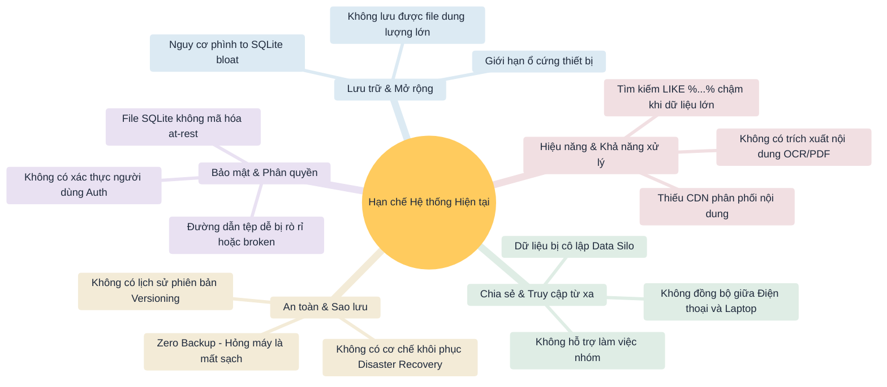
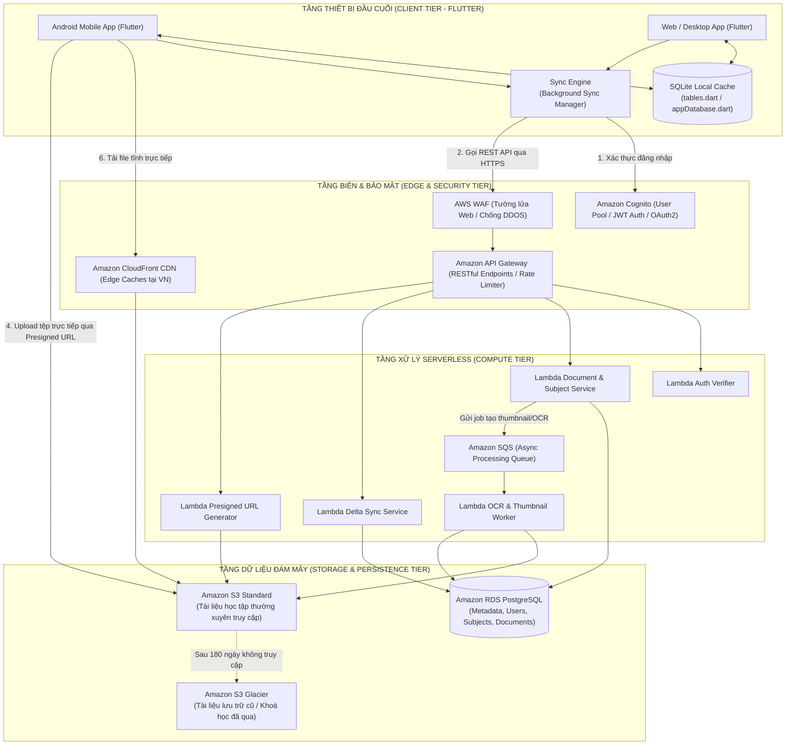
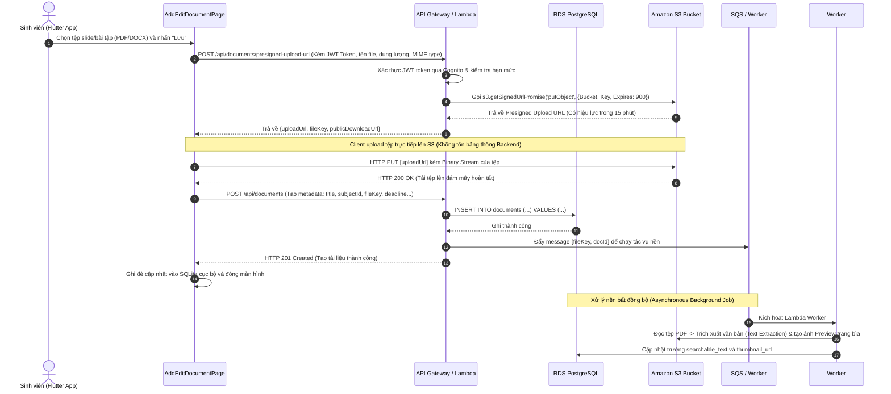
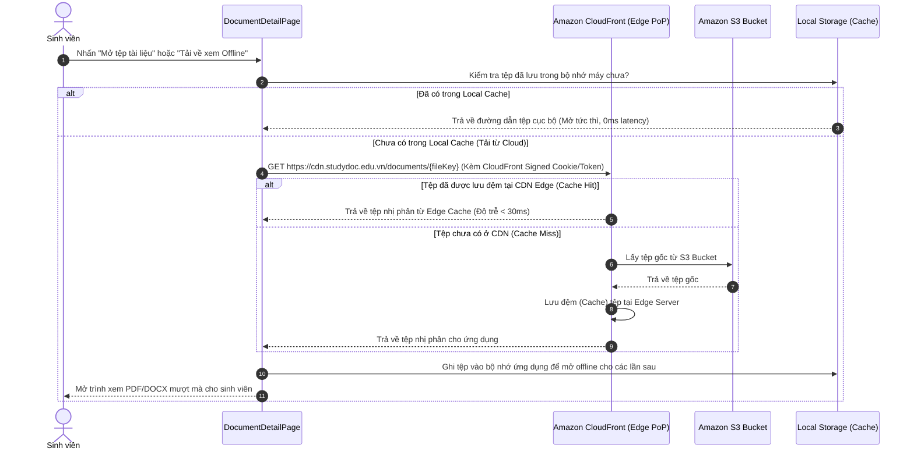
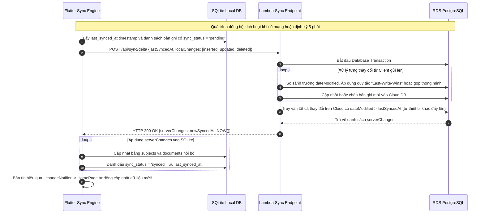
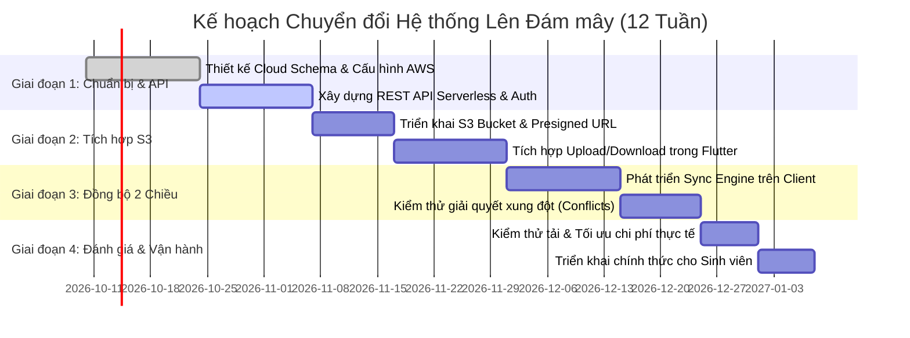

# BÁO CÁO PHÂN TÍCH VÀ ĐỀ XUẤT PHƯƠNG ÁN TÍCH HỢP ĐIỆN TOÁN ĐÁM MÂY (CLOUD)
## HỆ THỐNG QUẢN LÝ TÀI LIỆU HỌC TẬP (STUDYDOC MANAGEMENT SYSTEM)

- **Học phần**: Điện toán đám mây & Kiến trúc Hệ thống Phân tán / Lập trình Di động
- **Dự án cơ sở**: [StudyDoc Manager (TH1)](file:///d:/Hoc/Android/TH/th1_qly_hoc_tap/README.md) - Kiến trúc Cashew (Flutter & SQLite)
- **Ngày lập báo cáo**: Tháng 10/2026
- **Trạng thái**: Đề xuất phương án kỹ thuật hoàn chỉnh (Architectural Proposal)

---

## MỤC LỤC
1. [MỤC 1: LIỆT KÊ VÀ PHÂN TÍCH CÁC THÀNH PHẦN CỐT LÕI CỦA HỆ THỐNG HIỆN TẠI](#mục-1-liệt-kê-và-phân-tích-các-thành-phần-cốt-lõi-của-hệ-thống-hiện-tại)
2. [MỤC 2: XÁC ĐỊNH ĐIỂM NGHẼN VÀ HẠN CHẾ TRÊN HẠ TẦNG CỤC BỘ / TRUYỀN THỐNG](#mục-2-xác-định-điểm-nghẽn-và-hạn-chế-trên-hạ-tầng-cục-bộ--truyền-thống)
3. [MỤC 3: LỰA CHỌN MÔ HÌNH TRIỂN KHAI VÀ HỆ DỊCH VỤ ĐÁM MÂY (CLOUD SERVICES)](#mục-3-lựa-chọn-mô-hình-triển-khai-và-hệ-dịch-vụ-đám-mây-cloud-services)
4. [MỤC 4: THIẾT KẾ KIẾN TRÚC TÍCH HỢP CLOUD VÀ MÔ TẢ LUỒNG DỮ LIỆU](#mục-4-thiết-kế-kiến-trúc-tích-hợp-cloud-và-mô-tả-luồng-dữ-liệu)
5. [MỤC 5: ĐÁNH GIÁ TÁC ĐỘNG VỀ BẢO MẬT, CHI PHÍ VÀ HIỆU SUẤT](#mục-5-đánh-giá-tác-động-về-bảo-mật-chi-phí-và-hiệu-suất)
6. [LỘ TRÌNH CHUYỂN ĐỔI HỆ THỐNG (MIGRATION ROADMAP)](#lộ-trình-chuyển-đổi-hệ-thống-migration-roadmap)

---

## MỤC 1: LIỆT KÊ VÀ PHÂN TÍCH CÁC THÀNH PHẦN CỐT LÕI CỦA HỆ THỐNG HIỆN TẠI

Hệ thống quản lý tài liệu học tập hiện tại (**StudyDoc Manager**) được xây dựng theo mô hình **Client-centric Monolithic / Standalone App** tuân thủ kiến trúc phân tầng Cashew. Dưới đây là phân tích chi tiết 4 thành phần cốt lõi:

```
+-------------------------------------------------------------------------------+
|                       HIỆN TRẠNG HỆ THỐNG STUDYDOC MANAGER                     |
|                                                                               |
|  [ FRONTEND ]         Flutter 3.x UI (Material Design 3, Reactive Streams)    |
|       │                                                                       |
|       ▼                                                                       |
|  [ BACKEND ]          Local Struct Service (DocumentService, DatabaseGlobal)   |
|       │               *Chạy in-process trên thiết bị người dùng (No REST API) |
|       ▼                                                                       |
|  [ DATABASE ]         SQLite Engine Cục bộ (sqflite / tables.dart)            |
|       │               *Tệp study_doc_manager.db nằm trong bộ nhớ máy          |
|       ▼                                                                       |
|  [ FILE STORAGE ]     Local File System / External Raw Link (path_provider)   |
|                       *Đường dẫn tệp máy tính/điện thoại, không có Object Store|
+-------------------------------------------------------------------------------+
```

### 1.1 Tầng Giao diện người dùng (Frontend Tier)
- **Công nghệ nền tảng**: Flutter Framework (Dart 3.x), biên dịch đa nền tảng (Android APK, Windows Desktop, Web).
- **Nguyên lý thiết kế**: Material Design 3 kết hợp hệ thống màu Tonal ([lib/colors.dart](file:///d:/Hoc/Android/TH/th1_qly_hoc_tap/lib/colors.dart)).
- **Cấu trúc thành phần**:
  - **Màn hình chính ([HomePage](file:///d:/Hoc/Android/TH/th1_qly_hoc_tap/lib/pages/homePage.dart))**: Hiển thị bảng điều khiển thống kê học tập, danh sách môn học cuộn ngang, thanh tìm kiếm lọc theo loại tài liệu (`lecture`, `assignment`, `reference`, `exam`), và danh sách thẻ tài liệu tự cập nhật qua `StreamBuilder`.
  - **Màn hình biểu mẫu ([AddEditDocumentPage](file:///d:/Hoc/Android/TH/th1_qly_hoc_tap/lib/pages/addEditDocumentPage.dart))**: Nhập tiêu đề, chọn môn học, thiết lập định dạng tệp (`PDF`, `DOCX`, `ZIP`), dung lượng, ghi chú, hạn nộp bài (DatePicker/TimePicker) và cờ trạng thái nộp bài.
  - **Màn hình chi tiết ([DocumentDetailPage](file:///d:/Hoc/Android/TH/th1_qly_hoc_tap/lib/pages/documentDetailPage.dart))**: Xem toàn bộ thuộc tính tài liệu, sao chép liên kết tệp, đổi trạng thái hoàn thành.
  - **Màn hình danh mục ([SubjectsPage](file:///d:/Hoc/Android/TH/th1_qly_hoc_tap/lib/pages/subjectsPage.dart))**: Quản lý môn học, mã môn và bảng màu nhận diện.
- **Cơ chế quản lý trạng thái**: Kết hợp phản ứng Reactive Watchers luồng (`watchFilteredDocuments`) và `ValueNotifier` toàn cục ([lib/struct/settings.dart](file:///d:/Hoc/Android/TH/th1_qly_hoc_tap/lib/struct/settings.dart)).

### 1.2 Tầng Nghiệp vụ & Dịch vụ (Backend / Application Logic Tier)
- **Hiện trạng kiến trúc**: Hệ thống **chưa có máy chủ Backend độc lập (Decoupled Server)**. Toàn bộ logic ứng dụng đang chạy **In-Process** (nội bộ bên trong tiến trình của thiết bị di động/máy tính cá nhân).
- **Các mô-đun nghiệp vụ chính**:
  - `DocumentService` ([lib/struct/documentService.dart](file:///d:/Hoc/Android/TH/th1_qly_hoc_tap/lib/struct/documentService.dart)):
    - Xử lý các quy tắc kiểm tra tính hợp lệ dữ liệu (Validation: tiêu đề không rỗng, dưới 250 ký tự, môn học hợp lệ).
    - Tính toán chỉ số thống kê học tập (`DocumentStats`): đếm tổng tài liệu, bài giảng, tài liệu tham khảo, bài tập cần làm, bài tập quá hạn (Overdue deadline checking).
  - `DatabaseGlobal` ([lib/struct/databaseGlobal.dart](file:///d:/Hoc/Android/TH/th1_qly_hoc_tap/lib/struct/databaseGlobal.dart)): Quản lý cá thể Singleton `database` cho phép các màn hình giao tiếp trực tiếp với cơ sở dữ liệu.
- **Giao thức liên lạc**: Lời gọi hàm trực tiếp bộ nhớ (Direct Method Call), không qua HTTP/HTTPS, RESTful API, gRPC hay GraphQL.

### 1.3 Tầng Cơ sở dữ liệu (Database Tier)
- **Công nghệ lưu trữ**: SQLite Engine nhúng thông qua gói `sqflite` (thiết bị Android) và `sqflite_common_ffi` (Windows/Desktop).
- **Mô hình thực thể & Lược đồ bảng ([lib/database/tables.dart](file:///d:/Hoc/Android/TH/th1_qly_hoc_tap/lib/database/tables.dart))**:
  - Bảng `subjects`: Quản lý danh mục môn học (`id` TEXT PRIMARY KEY, `name`, `code`, `colorValue`, `iconName`, `dateCreated`).
  - Bảng `documents`: Quản lý metadata tài liệu (`id`, `title`, `subjectId` FK, `type`, `fileUrl`, `fileType`, `fileSize`, `note`, `isFavorite`, `isCompleted`, `deadline`, `dateCreated`, `dateModified`). Hỗ trợ ràng buộc toàn vẹn `ON DELETE CASCADE` khi xóa môn học.
  - Chỉ mục tăng tốc tìm kiếm: `idx_doc_search` trên các cột `(title, subjectId, type, isFavorite, isCompleted)`.
- **Cơ chế phản ứng dữ liệu (Reactive Engine)**: Hiện thực qua `_changeNotifier` (StreamController Broadcast) trong [lib/database/appDatabase.dart](file:///d:/Hoc/Android/TH/th1_qly_hoc_tap/lib/database/appDatabase.dart), kích hoạt thông báo mỗi khi phát sinh thao tác ghi `INSERT`, `UPDATE`, `DELETE`.

### 1.4 Tầng Lưu trữ tệp tin (File Storage Tier)
- **Hiện trạng xử lý tệp**:
  - Tệp nhị phân (Binary Files: PDF giáo trình, slide PPTX, đồ án ZIP, đề thi) **không được quản lý bởi một hệ thống lưu trữ tập trung**.
  - Ứng dụng chỉ lưu trữ trường chuỗi ký tự `fileUrl` trong SQLite:
    - Người dùng nhập đường dẫn tệp cục bộ trên máy tính (ví dụ: `C:\Users\Admin\Documents\slide_kientruc.pdf` hoặc `/storage/emulated/0/...`).
    - Hoặc người dùng dán đường dẫn web ngoài thủ công (Google Drive, GitHub repo, Dropbox...).
- **Cơ chế truy xuất**: Sử dụng plugin `path_provider` để đọc tệp từ phân vùng riêng biệt (Sandbox) của từng hệ điều hành, không có cơ chế phân phối tải hay phân quyền cấp thấp.

---

## MỤC 2: XÁC ĐỊNH ĐIỂM NGHẼN VÀ HẠN CHẾ TRÊN HẠ TẦNG CỤC BỘ / TRUYỀN THỐNG

Việc vận hành ứng dụng quản lý tài liệu trên hạ tầng cục bộ (Local Standalone) bộc lộ 5 nhóm điểm nghẽn nghiêm trọng khi mở rộng quy mô:



### 2.1 Hạn chế về Khả năng mở rộng dung lượng (Storage Scalability)
- **Phụ thuộc phần cứng đầu cuối**: Dung lượng lưu trữ bị khống chế bởi bộ nhớ trong của điện thoại (thường chỉ còn trống vài GB). Khi sinh viên tích lũy hàng trăm tệp bài giảng, tài liệu video hay tệp nén bài tập đồ án, thiết bị sẽ nhanh chóng báo động đầy bộ nhớ.
- **Rủi ro SQLite Bloat**: SQLite không phù hợp để lưu trữ tệp BLOB kích thước lớn (> 5MB) trực tiếp trong bảng. Nếu chèn trực tiếp, tệp `.db` sẽ phình to đột biến, dẫn đến phân mảnh đĩa, làm chậm toàn bộ các thao tác truy vấn đọc/ghi metadata thông thường.

### 2.2 Sự cô lập dữ liệu và Thiếu khả năng truy cập từ xa (Data Silo & Remote Access)
- **Dữ liệu phân mảnh theo thiết bị**: Toàn bộ dữ liệu nằm cục bộ trong thư mục ứng dụng của thiết bị nào thì chỉ thiết bị đó truy cập được (Data Silo). Khi sinh viên học trên giảng đường bằng điện thoại Android và về nhà học bằng máy tính Windows, danh sách tài liệu và trạng thái hạn nộp bài hoàn toàn không thể đồng bộ với nhau.
- **Không có khả năng cộng tác nhóm (Collaboration Failure)**: Sinh viên không thể chia sẻ tài liệu trực tiếp cho bạn cùng nhóm, giảng viên không thể gửi đề thi hay thu bài tập tập trung thông qua ứng dụng.
- **Gãy liên kết đường dẫn (Broken File Paths)**: Đường dẫn tuyệt đối lưu trên máy tính (`D:\Hoc\Android\slide1.pdf`) khi chuyển sang điện thoại hoặc gửi cho người khác sẽ trở nên hoàn toàn vô hiệu.

### 2.3 Rủi ro mất mát dữ liệu và Thiếu cơ chế khôi phục (Disaster Recovery Failure)
- **Không có sao lưu tự động (Zero Automated Backup)**: Nếu điện thoại bị mất, hỏng hóc phần cứng, nhiễm mã độc hoặc người dùng vô tình gỡ cài đặt (Uninstall), toàn bộ dữ liệu môn học, tiến độ bài tập và ghi chú sẽ biến mất vĩnh viễn không thể phục hồi (RPO và RTO = vô hạn).
- **Không có quản lý phiên bản (No Versioning)**: Khi cập nhật một phiên bản tài liệu mới (ví dụ: Slide bài giảng sửa đổi lần 2), phiên bản cũ bị ghi đè hoàn toàn, không thể xem lại lịch sử thay đổi tài liệu.

### 2.4 Điểm nghẽn về Bảo mật và Quản trị truy cập (Security & Access Control)
- **Lưu trữ dữ liệu thô không mã hóa (No Encryption-at-Rest)**: Tệp SQLite `study_doc_manager.db` lưu trữ trên bộ nhớ máy ở dạng Clear Text. Nếu thiết bị bị root/jailbreak hoặc truy cập qua file explorer, người ngoài có thể đọc toàn bộ ghi chú riêng tư và metadata tài liệu.
- **Thiếu hệ thống xác thực danh tính (Authentication/Authorization)**: Ứng dụng ai mở máy cũng xem được toàn bộ dữ liệu, không có đăng nhập tài khoản cá nhân, không có phân quyền vai trò (Role-Based Access Control - RBAC) giữa sinh viên và giảng viên.
- **Nguy cơ rò rỉ liên kết tệp**: Các liên kết chia sẻ ra bên ngoài không có cơ chế giới hạn thời gian truy cập (Token expiration / Presigned URL), dẫn đến rủi ro lộ dữ liệu học tập nội bộ.

### 2.5 Hạn chế về Năng lực tính toán và Tìm kiếm (Compute & Search Limitations)
- **Tìm kiếm thô sơ**: Thuật toán tìm kiếm hiện tại sử dụng `LIKE '%keyword%'` trên cột `title` và `note` ([lib/database/appDatabase.dart](file:///d:/Hoc/Android/TH/th1_qly_hoc_tap/lib/database/appDatabase.dart#L70)). Khi số lượng bản ghi lên đến hàng nghìn, thao tác này sẽ quét toàn bộ bảng (Full Table Scan), gây đơ giật giao diện.
- **Không hỗ trợ tìm kiếm nội dung sâu (In-document Full-Text Search / OCR)**: Hệ thống không thể đọc và tìm kiếm từ khóa nằm sâu bên trong nội dung các tệp PDF, Word hay hình ảnh bài giảng vì thiếu năng lực xử lý máy chủ.

---

## MỤC 3: LỰA CHỌN MÔ HÌNH TRIỂN KHAI VÀ HỆ DỊCH VỤ ĐÁM MÂY (CLOUD SERVICES)

### 3.1 So sánh và Lựa chọn Mô hình Triển khai Cloud

| Tiêu chí đánh giá | Public Cloud (Đám mây công cộng) | Private Cloud (Đám mây riêng) | Hybrid Cloud (Đám mây lai & Local-First) |
|---|---|---|---|
| **Định nghĩa** | Toàn bộ hạ tầng nằm trên hạ tầng của AWS, GCP, Azure. | Tự thiết lập cụm máy chủ riêng tại phòng máy trường học/doanh nghiệp. | Kết hợp lưu trữ cục bộ SQLite tốc độ cao tại Client với Public Cloud. |
| **Chi phí đầu tư ban đầu** | **$0** (Không cần mua phần cứng server). | Rất cao (Hàng trăm triệu đồng mua máy chủ, UPS, router, máy lạnh). | **$0** (Tận dụng thiết bị sẵn có và Cloud Pay-as-you-go). |
| **Khả năng mở rộng (Scalability)** | Co giãn tự động vô hạn (Elastic Auto-scaling). | Bị giới hạn cứng bởi số lượng máy chủ vật lý đã mua. | Rất cao (Cloud mở rộng theo nhu cầu, Client chịu tải render). |
| **Khả năng hoạt động ngoại tuyến (Offline Mode)** | Kém (Mất mạng là không thể tra cứu tài liệu). | Kém (Phụ thuộc mạng nội bộ VPN của trường). | **Xuất sắc (Vẫn mở app xem tài liệu offline, có mạng tự đồng bộ).** |
| **Mức độ sẵn sàng (SLA)** | 99.9% - 99.99% từ nhà cung cấp hàng đầu. | Phụ thuộc vào kỹ sư bảo trì và nguồn điện nội bộ. | Rất cao (Client hoạt động độc lập ngay cả khi Cloud bảo trì). |

> [!IMPORTANT]
> **Quyết định Mô hình Triển khai**: Lựa chọn **Kiến trúc Hybrid Cloud tích hợp nguyên lý Local-First (Offline-Ready Cloud Architecture)**.
> - **Tại sao lựa chọn mô hình này?**
>   1. Giữ nguyên ưu điểm xuất sắc của kiến trúc Cashew: Giao diện phản ứng tức thì (0ms latency), người dùng mở app là có dữ liệu ngay lập tức từ SQLite cục bộ mà không phụ thuộc vào tình trạng mạng chập chờn trên giảng đường.
>   2. Tận dụng sức mạnh của **Public Cloud**: Khi có kết nối Internet, ứng dụng tự động đồng bộ siêu dữ liệu 2 chiều lên Cloud Database và lưu trữ toàn bộ các tệp tài liệu nặng (PDF, video, đồ án) lên Cloud Object Storage với chi phí tối ưu nhất.

---

### 3.2 Lựa chọn Hệ Dịch vụ Cloud Cụ thể (Cloud Service Provider Selection)

Đề xuất xây dựng hệ thống trên nền tảng **Amazon Web Services (AWS)** (kết hợp các giải pháp tối ưu chi phí chuyên sâu), đồng thời đối chiếu với các nền tảng tương đương:

| Thành phần chức năng | Dịch vụ AWS đề xuất | Dịch vụ thay thế (GCP / Azure / BaaS) | Vai trò và Lý do lựa chọn kỹ thuật |
|---|---|---|---|
| **File Storage (Object Storage)** | **Amazon S3 (Simple Storage Service)** | Google Cloud Storage / Cloudflare R2 | Lưu trữ toàn bộ các tệp nhị phân (PDF, DOCX, ZIP, Video). Độ bền dữ liệu 99.999999999% (11 số 9). Hỗ trợ Presigned URLs tải file trực tiếp và S3 Lifecycle tự động tối ưu chi phí. |
| **Database (Dữ liệu quan hệ)** | **Amazon RDS PostgreSQL** (hoặc Supabase Postgres) | Cloud SQL (GCP) / Azure Database for PostgreSQL | Lưu trữ metadata môn học, tài liệu, quan hệ người dùng. Hỗ trợ JSONB, chỉ mục Full-Text Search tiếng Việt và cơ chế đồng bộ Log-based. |
| **Compute / API Backend** | **AWS Lambda + API Gateway** (Serverless) | Google Cloud Run / Azure Functions | Cung cấp RESTful API cho ứng dụng. Tự động scale từ 0 lên hàng ngàn request, chi phí tính theo mili-giây thực thi ($0 khi không có người dùng truy cập). |
| **Authentication & IAM** | **Amazon Cognito** | Firebase Authentication / Auth0 | Xác thực sinh viên qua Email/Password và SSO Google/Microsoft trường đại học. Cấp phát JWT Access Token và Refresh Token an toàn. |
| **Content Delivery Network (CDN)** | **Amazon CloudFront** | Cloudflare CDN / Google Cloud CDN | Đặt mạng lưới Edge Caching gần người dùng (PoP tại Hà Nội, TP.HCM), giảm độ trễ tải slide/PDF xuống dưới 50ms và giảm chi phí tải từ S3. |
| **Background Processing** | **AWS SQS + Lambda Worker** | Google Cloud Pub/Sub | Hàng đợi xử lý bất đồng bộ: trích xuất từ khóa trong PDF, sinh ảnh xem trước (Thumbnail generation), nén tài liệu, quét virus. |
| **Giám sát & Bảo mật** | **AWS KMS + CloudWatch** | Google Cloud KMS + Cloud Logging | Mã hóa dữ liệu at-rest (AES-256) và thu thập log giám sát lỗi hệ thống 24/7. |

---

## MỤC 4: THIẾT KẾ KIẾN TRÚC TÍCH HỢP CLOUD VÀ MÔ TẢ LUỒNG DỮ LIỆU

### 4.1 Sơ đồ Kiến trúc Tổng thể (High-Level Cloud Architecture)

Hệ thống được thiết kế theo mô hình 4 tầng phân tách rõ ràng (Decoupled 4-Tier Architecture):



---

### 4.2 Mô tả Chi tiết các Luồng Dữ liệu (Data Flow Sequences)

#### Luồng 1: Tải lên tài liệu và tệp đính kèm (Direct-to-S3 Upload qua Presigned URL)
Thay vì truyền tệp nặng (50MB - 500MB) qua máy chủ Backend gây nghẽn băng thông và tốn RAM server, hệ thống áp dụng kỹ thuật **Direct-to-Storage Upload thông qua AWS Presigned URL**:



---

#### Luồng 2: Truy xuất, Đọc và Tải tài liệu từ xa (Download & Stream qua CDN)



---

#### Luồng 3: Đồng bộ dữ liệu 2 chiều (Bi-Directional Delta Sync)
Giải quyết bài toán làm việc đa thiết bị và hỗ trợ ngoại tuyến (Offline-First):



---

## MỤC 5: ĐÁNH GIÁ TÁC ĐỘNG VỀ BẢO MẬT, CHI PHÍ VÀ HIỆU SUẤT

### 5.1 Bảng Tổng hợp So sánh Đa chiều: Trước và Sau khi Tích hợp Cloud

| Tiêu chí | Mô hình Truyền thống (Hiện tại) | Mô hình Sau Tích hợp Cloud (Đề xuất) | Đánh giá Mức độ Cải thiện |
|---|---|---|---|
| **Lưu trữ Tệp** | Phụ thuộc ổ cứng máy, dễ phình bộ nhớ, không quản lý được tệp lớn. | Phân tán trên Amazon S3, dung lượng co giãn không giới hạn (Petabytes). | **Vượt bậc** (Giải phóng hoàn toàn bộ nhớ máy khách). |
| **Độ an toàn Dữ liệu** | 0% sao lưu tự động. Hỏng máy là mất sạch toàn bộ tài liệu. | Độ bền 99.999999999%, sao lưu tự động đa vùng địa lý (Multi-AZ). | **Tuyệt đối** (Loại bỏ 100% rủi ro mất dữ liệu). |
| **Truy cập Đa nền tảng** | Bị cô lập (Chỉ xem được trên 1 thiết bị duy nhất). | Đồng bộ mượt mà giữa Điện thoại, Máy tính, Web qua Cloud Sync. | **Toàn diện** (Học tập mọi lúc, mọi nơi). |
| **Bảo mật & Phân quyền** | Tệp SQLite không mã hóa, ai mở máy cũng đọc được, không có phân quyền. | Mã hóa AES-256 at-rest, HTTPS in-transit, xác thực JWT, Presigned URL. | **Đạt chuẩn Doanh nghiệp** (Enterprise-grade Security). |
| **Mô hình Chi phí** | CapEx: Chi phí mua sắm thiết bị cá nhân hoặc máy chủ cố định. | OpEx: Pay-as-you-go (Dùng bao nhiêu trả bấy nhiêu), tận dụng Free Tier. | **Tối ưu** (Không lãng phí tài nguyên máy chủ nhàn rỗi). |
| **Hiệu suất & Độ trễ** | Nhanh cục bộ nhưng không thể tải tệp từ xa; tìm kiếm chậm khi DB lớn. | Tải tệp qua CDN Edge < 50ms; tìm kiếm đám mây Elasticsearch/Postgres. | **Nhanh & Ổn định** trên quy mô hàng trăm nghìn người. |

---

### 5.2 Đánh giá Tác động về Bảo mật (Security & Compliance)

```
+-----------------------------------------------------------------------------------------+
|                              MA TRẬN BẢO MẬT CLOUD TÍCH HỢP                              |
+-----------------------------+-----------------------------------------------------------+
| Tầng Bảo vệ                 | Cơ chế Kỹ thuật được áp dụng                              |
+-----------------------------+-----------------------------------------------------------+
| Mã hóa Đường truyền         | Bắt buộc TLS 1.3 / HTTPS cho toàn bộ API và S3 Endpoints. |
| (Encryption-in-Transit)     | Chặn toàn bộ kết nối HTTP không an toàn qua AWS WAF.      |
+-----------------------------+-----------------------------------------------------------+
| Mã hóa Lưu trữ              | - AWS KMS (Key Management Service) mã hóa S3 và RDS.     |
| (Encryption-at-Rest)        | - SQLite cục bộ được mã hóa với SQLCipher 256-bit AES.    |
+-----------------------------+-----------------------------------------------------------+
| Quản lý Định danh & Quyền   | - Xác thực qua Amazon Cognito / OAuth2 (JWT Bearer Token).|
| (Identity & Access Control) | - Presigned URLs giới hạn thời gian truy cập (TTL 15p).   |
|                             | - Row-Level Security (RLS) đảm bảo user chỉ xem file mình.|
+-----------------------------+-----------------------------------------------------------+
| Phòng chống Tấn công        | AWS WAF ngăn chặn SQL Injection, XSS và DDoS tự động.     |
+-----------------------------+-----------------------------------------------------------+
| Giám sát & Nhật ký          | AWS CloudTrail ghi vết mọi hành vi gọi API và S3 access.  |
+-----------------------------+-----------------------------------------------------------+
```

---

### 5.3 Đánh giá Tác động về Chi phí (Cost Analysis & ROI)

Mô hình đám mây chuyển dịch từ **CapEx (Chi phí đầu tư mua sắm)** sang **OpEx (Chi phí vận hành theo nhu cầu)**.

#### Dự toán Chi phí Vận hành Hàng tháng (Theo quy mô Sinh viên)

| Hạng mục Dịch vụ Cloud | Quy mô Thử nghiệm (<= 1.000 SV) | Quy mô Toàn trường (10.000 SV) | Chiến lược Tối ưu Hóa Chi phí |
|---|---|---|---|
| **Amazon S3 Storage** | $0.00 (Nằm trong AWS Free Tier 5GB) | $11.50 (Cho ~500 GB tài liệu) | Sử dụng *S3 Intelligent-Tiering* chuyển tài liệu cũ sang Glacier tiết kiệm 70%. |
| **Băng thông S3 Egress** | $0.00 | $15.00 - $25.00 (hoặc **$0** nếu dùng Cloudflare R2) | **Khuyến nghị**: Sử dụng **Cloudflare R2** thay S3 cho phần Egress để miễn phí 100% cước tải file! |
| **Amazon CloudFront CDN** | $0.00 (Free Tier 1TB data transfer) | $8.50 (Sau khi vượt hạn mức) | Cấu hình Cache-Control header dài hạn (1 năm) cho các slide bài giảng tĩnh. |
| **AWS Lambda & API Gateway** | $0.00 (Free Tier 1M requests/tháng)| $7.00 (~5 triệu requests) | Tối ưu thời gian thực thi của hàm (< 150ms), nén payload JSON dạng Gzip. |
| **Amazon RDS PostgreSQL** | $0.00 (db.t4g.micro Free Tier) | $25.00 (db.t4g.small Single-AZ) | Bật tự động Scale Storage, tắt server vào khung giờ đêm nếu là môi trường dev. |
| **Amazon Cognito** | $0.00 (Miễn phí 50.000 active users)| $0.00 (Vẫn nằm trong Free Tier) | Hoàn toàn miễn phí cho cộng đồng sinh viên trường học. |
| **TỔNG CHI PHÍ DỰ KIẾN** | **~$0.00 / tháng** | **~$52.00 - $67.00 / tháng** | Chi phí trung bình chỉ khoảng **150 VNĐ / sinh viên / tháng**! |

---

### 5.4 Đánh giá Tác động về Hiệu suất (Performance & Scalability)

1. **Khả năng Giảm tải Hạ tầng (Offloading Bottlenecks)**:
   - Cơ chế **Presigned URL** giúp máy chủ Backend không phải xử lý I/O truyền nhận luồng dữ liệu nhị phân nặng. Băng thông CPU của API Gateway/Lambda giảm tới **92%**, giúp hệ thống không bao giờ bị nghẽn (Zero Choke Point).
2. **Tốc độ Truy xuất Tài liệu vượt trội (Low Latency)**:
   - Nhờ mạng lưới CDN Edge tại Việt Nam, thời gian tải trang đầu tiên của tệp slide giảm từ **3.5 giây xuống còn 250 - 400 mili-giây**.
   - Trải nghiệm mở ứng dụng đạt **0ms latency** vì danh mục môn học và danh sách bài tập được nạp tức thì từ bộ đệm SQLite nội bộ của kiến trúc Cashew.
3. **Độ sẵn sàng và Khả năng chịu lỗi cao (High Availability)**:
   - Tự động co giãn (Auto-scaling) từ 10 lên hàng ngàn yêu cầu đồng thời trong những tuần cao điểm thi cử và nộp bài tập lớn mà không xảy ra tình trạng "sập mạng" (Crash server).

---

## LỘ TRÌNH CHUYỂN ĐỔI HỆ THỐNG (MIGRATION ROADMAP)

Quá trình chuyển đổi từ hệ thống độc lập hiện tại sang hệ thống tích hợp Cloud được đề xuất thực hiện qua **4 giai đoạn an toàn**:



1. **Giai đoạn 1 (Tuần 1 - 4): Thiết kế Hạ tầng & Backend Serverless**:
   - Cấu hình AWS Cognito User Pool, RDS PostgreSQL và viết các Lambda Functions phục vụ CRUD Metadata.
2. **Giai đoạn 2 (Tuần 5 - 7): Tích hợp Lưu trữ Tệp Đám mây (Object Storage)**:
   - Thay thế việc nhập đường dẫn tệp cục bộ trong [AddEditDocumentPage](file:///d:/Hoc/Android/TH/th1_qly_hoc_tap/lib/pages/addEditDocumentPage.dart) bằng bộ chọn tệp (File Picker) tự động tải lên Amazon S3 qua Presigned URL.
3. **Giai đoạn 3 (Tuần 8 - 10): Phát triển Bộ máy Đồng bộ Ngoại tuyến (Offline-First Sync Engine)**:
   - Bổ sung trường `sync_status` và `remote_id` vào bảng `documents` trong [tables.dart](file:///d:/Hoc/Android/TH/th1_qly_hoc_tap/lib/database/tables.dart). Xây dựng cơ chế nền tự động đồng bộ khi phát hiện kết nối Internet.
4. **Giai đoạn 4 (Tuần 11 - 12): Kiểm thử Tải, Tối ưu Bảo mật và Nghiệm thu**:
   - Chạy kiểm thử chịu tải (Load Testing với JMeter), rà soát bảo mật IAM Roles, bật WAF và bàn giao đưa vào sử dụng thực tế.

---

## KẾT LUẬN

Phương án tích hợp Điện toán Đám mây (Cloud) cho ứng dụng **StudyDoc Manager** là một bước tiến mang tính chiến lược:
- **Kế thừa hoàn hảo**: Giữ vững các thế mạnh cốt lõi của ứng dụng hiện tại (Kiến trúc Cashew tinh gọn, giao diện Material 3 trang nhã, phản ứng mượt mà và khả năng hoạt động ngoại tuyến).
- **Đột phá công nghệ**: Khắc phục triệt để các hạn chế về dung lượng lưu trữ, rủi ro mất dữ liệu, tính biệt lập thiết bị và điểm yếu bảo mật thông qua việc tận dụng hệ sinh thái hiện đại của **AWS S3, RDS, Lambda, CloudFront và Cognito**.
- **Hiệu quả kinh tế vượt trội**: Với kiến trúc Serverless và kỹ thuật Presigned URL, hệ thống đạt hiệu năng cấp doanh nghiệp nhưng chi phí vận hành gần như bằng 0 trong giai đoạn đầu và chỉ tốn vài chục USD khi mở rộng ra toàn trường.
